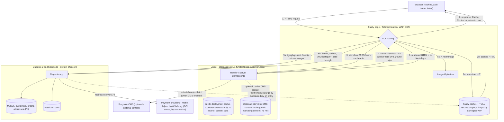

# Horizon Storefront — Security & Compliance Data Flow (Magento 2)

Audience: Security & Compliance Officer.
Scope: Horizon Storefront headless deployment with Vercel (Next.js) + Fastly (CDN/VCL) + Magento 2 on Hypernode. Optional Storyblok CMS noted where applicable.

This document complements the architecture page on
[devdocs.experius.nl/documentation/architecture-3.x](https://devdocs.experius.nl/documentation/architecture-3.x). It corrects one detail that matters for security review: Vercel's render functions do **not** talk to Magento directly — they re-enter the **same Fastly service** to reach Magento. All cookie stripping, cache hashing, and surrogate-key tagging applied to `/graphql` happen on that second pass.

## End-to-end request flow



### Step-by-step narrative

1. The browser opens an HTTPS connection to the public storefront hostname. TLS terminates at Fastly.
2. Fastly's VCL evaluates the request:
   - Storefront HTML/JSON: looked up in the Fastly edge cache by `Surrogate-Key` (`X-Next-Tags`). On a HIT, the response is delivered directly to the browser.
3. On a MISS or for explicitly non-cacheable storefront paths, the request is forwarded to Vercel.
4. Vercel's Next.js render functions fetch data **back through the same Fastly hostname** (server-side fetch). This is the round-trip the source diagram omits.
5. Fastly's VCL routes the second-pass request based on the URL path:
   - `5a` Storefront-side Magento APIs: `/graphql`, `/rest`, `/api/graphql`, `/media`, `/storemanager`, `/sitemap`, `/static/version`, `/.well-known` go to the Magento (Hypernode) origin. GraphQL responses may be cached by Fastly when `X-Magento-Cache-Id` is present and matches; cookies are stripped on `/graphql` in `vcl_recv` and `vcl_fetch`.
   - `5b` Payment paths (`/mollie`, `/adyen`, `/multisafepay`, and the per-store-view variants) are marked pass-through and **never cached**. They go straight to Magento, which redirects/proxies to the PSP.
   - `5c` Next.js image requests (`/_next/image`) are handled by Fastly's Image Optimizer; the original image is fetched from its source host.
6. Vercel returns rendered HTML with the `X-Next-Tags` surrogate header.
7. Fastly stores the response in the edge cache (keyed by `X-Next-Tags`) and delivers it to the browser with `Cache-Control: no-store, no-cache, must-revalidate, max-age=0` so end-user browsers do not cache personalized HTML.

Cache invalidation: the Fastly Magento module issues `Surrogate-Key` purges to the Fastly cache when entities change in Magento (products, categories, CMS content). No data flows from Magento to Vercel during purge — only to the Fastly edge.

## Where data lives

The compliance question is "where is data persisted, and which hops touch PII?" Per component:

### Browser (end user)
- Holds session cookie, auth bearer token (when logged in), cart token, and cookies set by the storefront.
- Standard client-side PII surface — covered by the storefront's cookie banner / consent flow.

### Fastly edge — CDN / cache / WAF
- TLS terminates here; Fastly is the only public ingress.
- Cache contents:
  - Storefront HTML / JSON keyed by `Surrogate-Key = X-Next-Tags`.
  - Magento GraphQL responses keyed by `X-Magento-Cache-Id`, `Store`, `Content-Currency` (see `process_graphql_headers`).
  - Optimized images (transformed copies of source assets).
- Cookie hygiene: `set-cookie` stripped on `/graphql` request and response; authenticated GraphQL is **only** cached when the response's `X-Magento-Cache-Id` matches the request's, otherwise `beresp.cacheable = false` and `beresp.ttl = 0s`.
- **No persistent storage.** Ephemeral edge cache only; purged on demand by the Fastly Magento module.

### Vercel — stateless Next.js functions
- Runs the storefront's Server Components / API routes. Transient per-request memory only.
- **No database. No persistent customer data.**
- Runtime logs are emitted by Vercel's platform — the storefront code must not log PII (auth tokens, addresses, order details). This is a code-review responsibility.

### Vercel platform caches
The only data Vercel persists for this stack is the **build/deployment cache** — codebase artifacts, static assets, and function bundles produced at deploy time. It contains no user data and no live content data, and is **not used for runtime caching of customer-facing content**.

The single optional exception is **Storyblok CMS content**: when Storyblok is enabled, editorial content (pages, blocks, marketing copy) may be cached on Vercel via the Next.js data cache or ISR for performance. This content is public marketing material and contains no PII.

All other Vercel data-cache surfaces (Next.js data cache for commerce calls, ISR of personalized pages, etc.) are intentionally **unused** on this stack — commerce caching lives entirely at the Fastly edge.

### Storyblok (optional)
- Editorial / marketing content only. No customer data, no order data, no PII.
- Read-only from the storefront's perspective.

### Magento 2 on Hypernode — system of record
- The **only** system of record for customer PII (accounts, addresses, orders, sessions, carts).
- All compliance, retention, GDPR / DSAR, and backup controls live here.
- Hosted on Hypernode (managed Magento hosting). Access is restricted to Magento application paths via Fastly's host conditions:
  ```
  ^(/storemanager|/index.php/|/static/version|/media|/_next/image|/sitemap|/graphql|/rest/|/api/graphql|/.well-known|/mollie/|/(.*)/mollie/|/(.*)/adyen/|/adyen/|/multisafepay/|/(.*)/multisafepay/)
  ```

### Payment providers (PCI scope)
- Mollie, Adyen, MultiSafepay. Card data and payment instruments live with the PSP, not with the storefront.
- Storefront and Vercel never see PAN. Payment URL paths are configured pass-through in Fastly so responses are never cached at the edge.

## Trust boundaries at a glance

| From → To | Transport | What crosses | What does NOT cross |
|---|---|---|---|
| Browser → Fastly | TLS 1.2+ | Request, cookies, auth bearer | — |
| Fastly → Vercel | TLS, origin auth | Sanitized request, no Magento cookies on `/graphql` | Raw Magento session cookies on GraphQL |
| Vercel → Fastly (round-trip) | TLS | Server-side fetch for Magento data | Magento-direct egress (does not exist) |
| Fastly → Magento (Hypernode) | TLS | GraphQL / REST / media / payment paths | Cached responses (origin always sees the request on a MISS) |
| Magento → PSP | TLS | Payment intent / redirect | Storefront / Vercel intermediation |
| Magento → Fastly | API key (Purge scope only) | Surrogate-Key purge calls | Customer data |

## What this document does not cover

- BigCommerce or Medusa headless paths (this stack is Magento 2).
- Operational concerns inside Hypernode (Magento patching, DB backups, admin SSO).
- PSP-side compliance (handled by the PSPs' own attestations).
- Vercel project settings (env vars, deployment protection) — managed in the Vercel dashboard, not this repo.

## Source-of-truth references

- Architecture page (VCL snippets, Fastly config): [devdocs.experius.nl/documentation/architecture-3.x](https://devdocs.experius.nl/documentation/architecture-3.x)
- Fastly Magento module: [github.com/fastly/fastly-magento2](https://github.com/fastly/fastly-magento2)
- Horizon Storefront developer docs: [devdocs.experius.nl](https://devdocs.experius.nl/)
